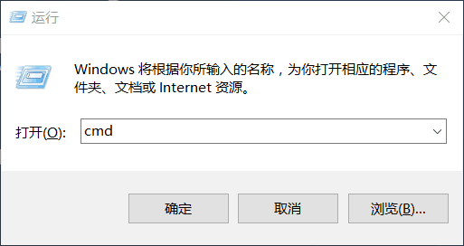
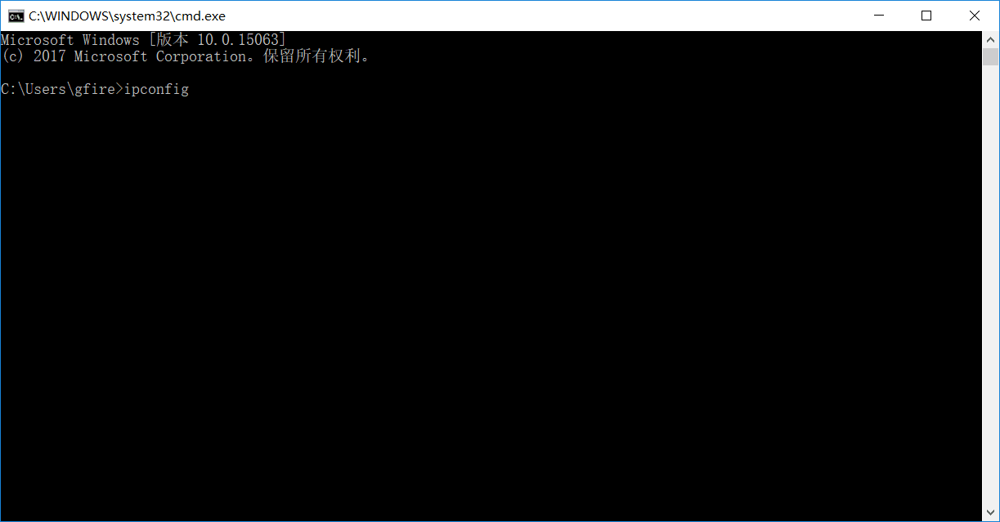
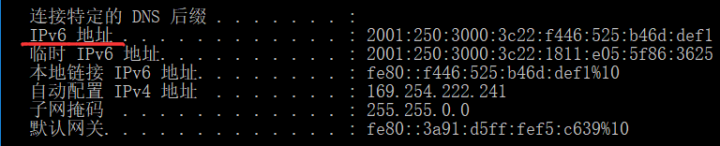
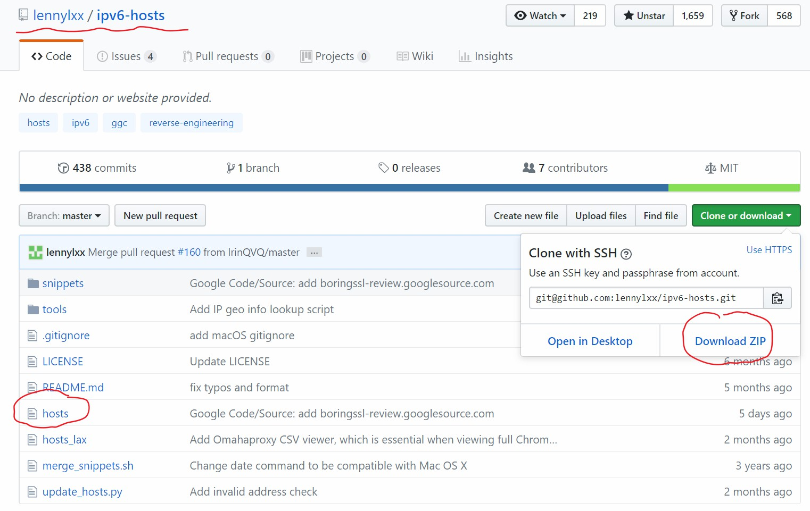
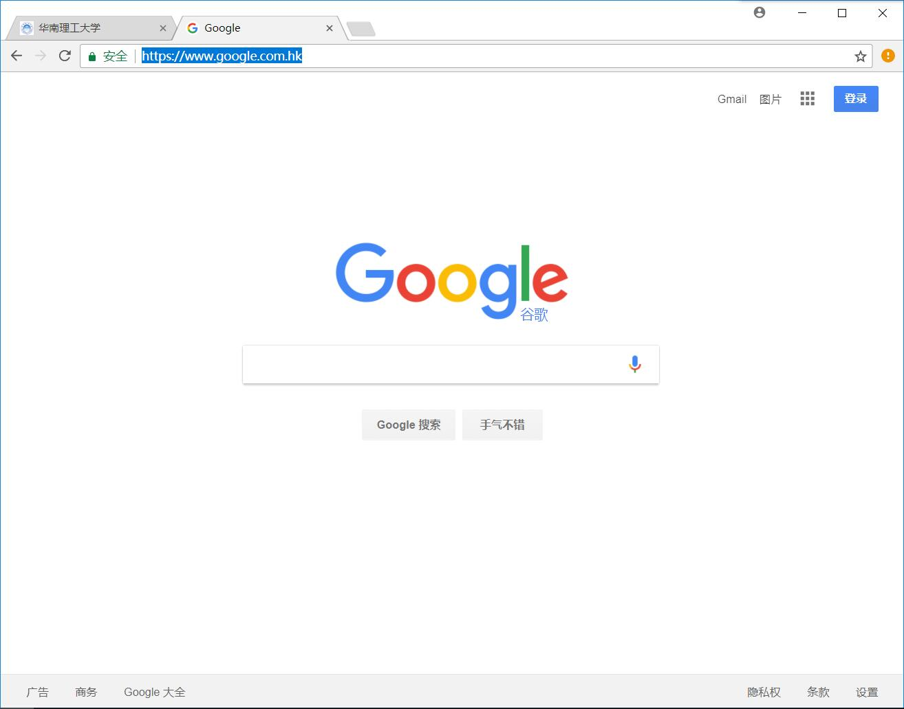

> 在下补充两点：一是，这篇文章可能有点敏感，所以尽量不传到外院，大家珍惜机会利用网络资源搜索资料；二是，据说v6不稳定且会炸，加上VPS流量有限，所以平时不要滥用，珍惜资源。

<!-- TOC -->

- [连网线](#连网线)
- [在dos命令行确认电脑有IPv6地址](#在dos命令行确认电脑有ipv6地址)
- [修改host文件](#修改host文件)
- [浏览网页](#浏览网页)
- [访问国内网站](#访问国内网站)
- [进阶](#进阶)

<!-- /TOC -->
网络资源对电信学子来说是非常重要的，但南校电信学院在大一被禁止使用网络，严重阻碍大家汲取知识的脚步，故稍加指导利用v6网络，等到大二能缴费使用v4网络请自觉缴费。若文章过于敏感会删除。请跟着一下步骤：

### 连网线
断开无线连接，使用有线连接，即用网线连好（C10可以购买网线，价格便宜）
### 在dos命令行确认电脑有IPv6地址

a. win+r组合键得到运行窗口，输入cmd

b. 得到dos命令行，输入ipconfig

c. 得到网络信息，查看一下能得到ipv6地址，说明电脑已经连上ipv6网络。如果没有v6地址，查看是否将ipv6地址设置成自动获取，windows默认开启IPv6和IPv4。

### 修改host文件
先将`C:\Windows\System32\drivers\etc\hosts`备份，然后将修改后的[hosts](https://github.com/lennylxx/ipv6-hosts)覆盖在的`C:\Windows\System32\drivers\etc\hosts`，其中修改后的hosts可从github链接获取。

### 浏览网页
打开浏览器，输入`https://www.google.com.hk`，能看到网页。也可以试试其他网址，只要是hosts文件有解析的网址就可以。

### 访问国内网站
国内带有ipv6的域名不多，一般是国外比较有名的网站比如google和youtube以及国内的ipv6直播，如果想用ipv6访问国内的大部分网站，需要找个同时有v4和v6的vps，再搭个梯子就可以。内容易河蟹，具体不细说，参考文章[Shadowsocks,Vultr,IPV6搭建校园网免流量环境](https://watsonyanghx.github.io/2016/10/05/Shadowsocks-Vultr-IPV6%E6%90%AD%E5%BB%BA%E6%A0%A1%E5%9B%AD%E7%BD%91%E5%85%8D%E6%B5%81%E9%87%8F%E7%8E%AF%E5%A2%83/)。

### 进阶
以上内容都有点小白化，但愿能让大家明白，目的是希望大一新生接触网络资源。接着介绍一位兄台的文章，包括折腾ipv6和路由器：[校园网配置ss-ipv6上网 (Padavan /OpenWrt /LEDE)](http://www.jianshu.com/p/c353d74a4be7)，感谢他的贡献！

---
致谢：14级不愿透漏姓名的舍友 17级不愿透漏姓名的帅气师弟 